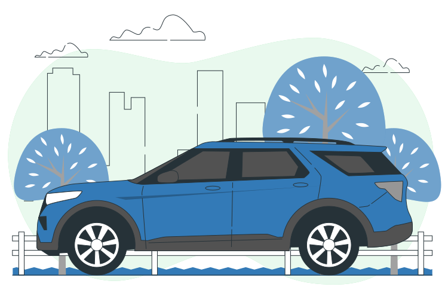
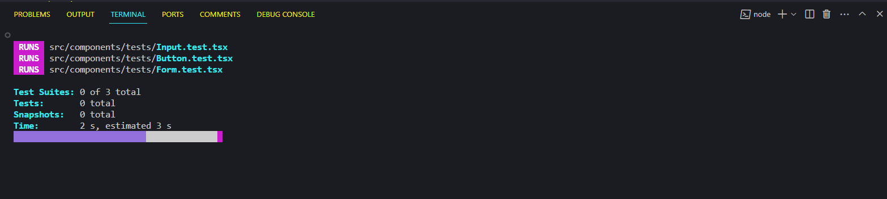

  

> <h2>Índice</h2>

<ul>
	<li>Sobre</li>
	<li>Tecnologias</li>
	<li>Um Pouco do Projeto</li>
	<li>Instalando</li>
    <li>Testes</li>
</ul>

## Sobre

Um formulário de cadastro para a empresa Cox Automotive, a maior empresa do mundo em soluções para o mercado automotivo. Nesse formulário implementei o auto preenchimento de informações do endereço através do valor do CEP inserido pelo usuário.

 Esse formulário foi desenvolvido para consumir a API ViaCep para que pudesse a partir do cep inserido pelo usuário, preencher automaticamente os campos de UF, Cidade, Logradouro e Bairro. Além disso, foi utilizado o Framework de CSS Bootstrap para estilizar o site e o Framework Redux para o controle de estado. Por fim, foi desenvolvido testes unitários com o Jest e o Testing Library.

## Tecnologias
* HTML
* CSS
* TypeScript
* React
* Bootstrap
* Redux
* Jest

## Um Pouco do Projeto
<ul>
  <li> <h2>Tela de Cadastro</h2> </li>
    

    
  <li> <h2>Tela de Cadastro com a Lista de Usuários</h2> </li>
    

</ul>

## Testes
Teste unitários realizados com o Framework Jest e com Testing Library.

  

## Instalando

Para utilizar o projeto é necessário ter o Node.JS na versão LTS.

Este projeto foi inicializado com [Create React App]

  ### Instalando as dependências
  
  `npm install`

  ### No diretório do projeto, você pode executar:

 `npm start`

Executa o aplicativo no modo de desenvolvimento.\
Abra [http://localhost:3000](http://localhost:3000) para visualizá-lo no navegador.

### `npm test`

Inicia o executor de teste no modo de observação interativo.

<h3> “Transformando a maneira como o mundo </h3>
<h3> compra, vende, usa e compartilha veículos” </h3>
